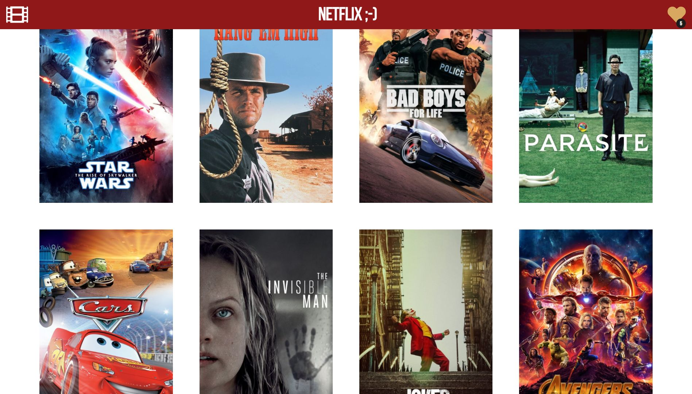
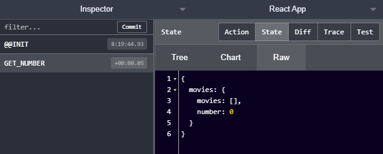

# React - Redux - Firebase: Master React from A to Z - Create your own NETFLIX


*April / May 2020*

> 🔨 All React in Depth from scratch, with Redux, React Router DOM, Firebase, Paypal (Sand Box),
React Player, themoviedb. From Udemy
'[Maitriser React de A à Z - Créer son propre NETFLIX](https://www.udemy.com/course/maitriser-react-de-a-a-z-creer-son-propre-netflix/)'.




## About

### Concepts covered

**- Decompose and prioritize main components**

    App

    ---Header

    ---Home page:

    ------Header Img

    ------Searchbar

    ------Posters List

    ---------Poster

    ------------Item

    ---------------Header

    ---------------HeaderDetails

    ---------------Stars

    ---------------Container

    ---------------Actor List

    ------------------Actor List

    ------Load Button / see more

**- Decompose and prioritize Player Components**

    App

    ---Header

    ---MoviePlayer

    ------VideoPlayer

    ------MvPlayerList

    ---------MvPlayerListItem

**- Decompose routing**

    App

    ---Header

    ---Details

    ------HeaderDetails

    ---------Container

    ---------Stars

    ------ActorList

    ---------Actors

**- Decompose Redux**

**- State and Lifecycle of Components**


**- Higher-order components (HOC)**

Function that takes a component as parameter and that return another component

**- When to use states**

- Does the data come(s) from a parent component with props?
- Does it stays unchanged during process?
- Can it be calculated using another state or props from the component?

=> 3xNO -> *usually* use states

=> identify in which component(s) the states have to 'live'

**- Why use React.Fragment**

`<React.Fragment></React.Fragment>` or `<></>`: used if we do not begin with
html or if we use invalid DOM in JSX:
"Fragments let you group a list of children without adding extra nodes to the DOM."

**- Inverted data flow**

Send data From children component to parent (ex: SearchBar, LoadingButton).

**- React Router (Route, Link, Switch)**

When you need to navigate through a React application with multiple views,
you’ll need a router to manage the URLs. React Router takes care of that,
keeping your application UI and the URL in sync.

**- Redux**

A Predictable State Container for JS Apps.


See my watch about [Redux](https://docs.google.com/presentation/d/1EvizpkOZKV1wntQODdG3H05CArLIxwIG46INIvsqdDI/edit#slide=id.gc6f73a04f_0_0)

[Playground to test the following exemple](https://stephengrider.github.io/JSPlaygrounds/)

*Exemple*

```
//Initial state
const initialState = {
  "name": "Vincent",
  "age": 42
}

//REDUCER (state, action)
//Pure: always return a new state
//We use one reducer, but we can use several reducers if needed

const reducer = (state = initialState, action) => {
  //If an action is dispatched
  if(action.type === "INCREMENT_AGE"){
    return {
      "name": state.name,
      "age": state.age + action.payload //payload = data emited
    }
  }
  if(action.type === "CHANGE_NAME"){
    return {
      "name": action.payload,
      "age": state.age
    }
  }
  //Return the new state to the store
  return state;
}

//STORE
//There is only one store
const store = Redux.createStore(reducer);

//Value of global state
store.getState()
// => {"name":"Vincent","age":42}

//ACTION CREATORS
//Functions that take arguments and return an action.

//Action 1 (it will display the state again)
const action1 = {
 type: "INCREMENT_AGE", //type is mandatory
 payload: 3 //properties can have any name
}
// => {"name":"Vincent","age":42}

//Dispatch action1 to reducer
store.dispatch(action1);
// => "type":"INCREMENT_AGE","payload":3}

//New state
//Value of new state in the store
store.getState();
// => {"name":"Vincent","age":45}

//Action 2 (it will display the state again)
const action2 = {
  type: "CHANGE_NAME",
  payload: "Daniel"
}
// => {"name":"Vincent","age":45}

//Dispatch action2 to reducer
store.dispatch(action2)
// => {"type":"CHANGE_NAME","payload":"Daniel"}

//New state
//Value of new state in the store
store.getState();
// => {"name":"Daniel","age":45}

```

**- Redux: Connect**

Higher-order component, connect components to Redux.

`connect (A, B)(Component)`

- A: function mapStateToProps, is used for selecting the part of the data from the store
that the connected component needs.
- B: function mapDispatchToProps, is used for dispatching actions to the store.



## How to use

### Localy

Clone,

Then:

```
npm install
npm start
```

Open the app using [http://localhost:3000/](http://localhost:3000/)

Build test:

````
npm install -g serve
serve -s build
````

Open the app using [http://localhost:5000/](http://localhost:5000/)

**Warning: you have to rename *_config.js* by *config.js* and provide your own key for API TMDB**

### Online

See demo on [GitHub page](#).

## Packages used

- [React Icons](https://react-icons.github.io/react-icons/#/)

  `npm i react-icons --save`

- [Bootstrap](https://www.npmjs.com/package/bootstrap)

  `npm i bootstrap --save`

- [Axios](https://www.npmjs.com/package/axios)

  `npm i axios --save`

- [React Cookie Consent](https://www.npmjs.com/package/react-cookie-consent)

  `npm i react-cookie-consent`

- [React Router Dom](https://www.npmjs.com/package/react-router-dom)

  `npm i react-router-dom`

- [Redux](https://www.npmjs.com/package/redux)

  `npm i redux`

- [React Redux](https://www.npmjs.com/package/react-redux)

  `npm i react-redux`

- [ReactPlayer](https://www.npmjs.com/package/react-player)

  `npm i react-player`

- [Lodash](https://www.npmjs.com/package/lodash)

  Provides utility functions for common programming tasks using the functional programming paradigm.

  `npm i lodash`

- [Firebase](https://www.npmjs.com/package/firebase)

  `npm i firebase`

- [FirebaseUI React Components](https://www.npmjs.com/package/react-firebaseui)

  `npm i react-firebaseui`

- [Bootstrap](https://www.npmjs.com/package/bootstrap)

  `npm i bootstrap`

- [Reactstrap](https://www.npmjs.com/package/reactstrap)

  `npm i reactstrap`

- [React Paypal Express Checkout](https://www.npmjs.com/package/react-paypal-express-checkout)

  `npm i react-paypal-express-checkout`

## Useful links

- [Udemy: Maitriser React de A à Z - Créer son propre NETFLIX](https://www.udemy.com/course/maitriser-react-de-a-a-z-creer-son-propre-netflix/)
- [Formation React - Maitriser le framework](https://www.youtube.com/playlist?list=PLNq4tyVELD8fNXdblniGlfAd4NJAyt1Mz)
- [GitHub: udemy-react-netflix](https://github.com/JulienKisoni/udemy-react-netflix)
- [React.Component](https://fr.reactjs.org/docs/react-component.html)
- [React Lifecycle Methods diagram](http://projects.wojtekmaj.pl/react-lifecycle-methods-diagram/)
- [ReactJS Higher Order Components Tutorial](https://www.codingame.com/playgrounds/8595/reactjs-higher-order-components-tutorial)
- [React Developer Tools Chrome](https://chrome.google.com/webstore/detail/react-developer-tools/fmkadmapgofadopljbjfkapdkoienihi?hl=en)
- [React Developer Tools Firefox](https://addons.mozilla.org/en-US/firefox/addon/react-devtools/)
- [Redux Developer Tools Chrome](https://chrome.google.com/webstore/detail/redux-devtools/lmhkpmbekcpmknklioeibfkpmmfibljd?hl=en)
- [Redux Developer Tools Firefox](https://addons.mozilla.org/en-US/firefox/addon/reduxdevtools/)
- [VSC: Reactjs code snippets](https://marketplace.visualstudio.com/items?itemName=xabikos.ReactSnippets)
- [Using index.js for Fun and Public Interfaces](https://alligator.io/react/index-js-public-interfaces/)
- [ReactJS Inverse Data Flow in ES6](https://medium.com/@jtabach/reactjs-inverse-data-flow-in-es6-9d1c3c356be7)
- [API TMDB (The Movie DataBase)](https://www.themoviedb.org/)
- [Template literals (Template strings)](https://developer.mozilla.org/en-US/docs/Web/JavaScript/Reference/Template_literals)
- [10 Lodash functions everyone should know](https://medium.com/voobans-tech-stories/10-lodash-functions-everyone-should-know-334b372aec5d)
- [Reactstrap](https://reactstrap.github.io/)
- [Developer tools and resources to integrate PayPal Commerce Platform](https://developer.paypal.com/home/)
- [Sandbox Paypal](https://www.sandbox.paypal.com/myaccount/summary)
- [How to Deploy Your React App to Heroku](https://medium.com/better-programming/how-to-deploy-your-react-app-to-heroku-aedc28b218ae)
- [Heroku Buildpack for Node.js](https://elements.heroku.com/buildpacks/heroku/heroku-buildpack-nodejs)
- [Deployment](https://create-react-app.dev/docs/deployment/)
- [Heroku Configuration and Config Vars](https://devcenter.heroku.com/articles/config-vars)
- [Causes of Heroku H10-App Crashed Error And How To Solve Them](https://dev.to/lawrence_eagles/causes-of-heroku-h10-app-crashed-error-and-how-to-solve-them-3jnl)